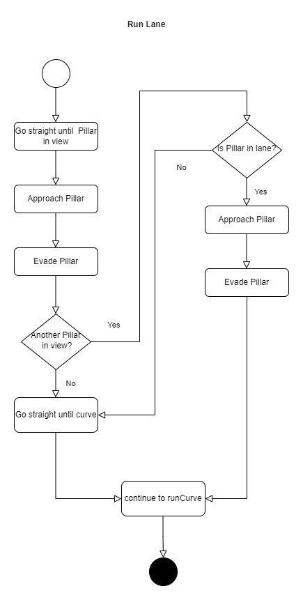

# Flow chart Description

## Starting Phase Obstacle race
At the beginning the car drives at slow speed. As soon as a pillar is detected in the field of vision, the car checks its position. If the pillar is directly in front of the car, it will be avoided. The car then heads to the opposite wall to determine the exact direction of travel. Depending on whether the pillar was left or right, the car determines its direction of rotation and continues its journey. It then enters the running phase of the race.

## Running Phase
In the run phase, we navigate a lane with obstacles followed by a curve until we've passed 8 corners. Upon reaching the next lane, we conclude the second round and need to determine whether to execute a U-Turn. This decision is facilitated by a specialized version of the 'runLane' function. Afterward, we proceed to the final round.

## Runlane Detailed
In the 'runLane' detail, the process begins by driving straight until a pillar is detected. Upon detection, the car approaches and subsequently evades the pillar. The system then assesses whether a second pillar is visible. By evaluating its x-position in the camera image, it determines whether the pillar is positioned within the lane or beyond the upcoming curve. If the pillar is within the lane, the car approaches and evades it. If not, the car continues driving straight until the next curve is detected.

